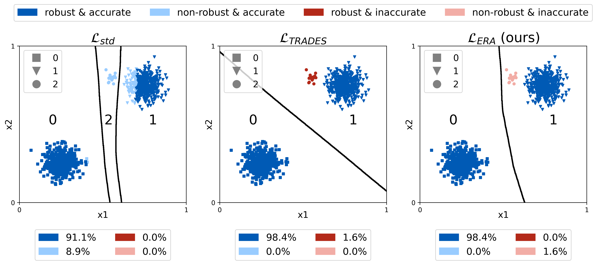

# robust-abstain

This it the official codebase for the paper Just Avoid Robust Inaccuracy: Boosting Robustness Without Sacrificing Accuracy.

**Table of Contents**<br>
1.  [Project Structure](#project-structure) <br>
2.  [Installation](#installation) <br>
3.  [Datasets](#datasets) <br>
4.  [Models](#models) <br>
6.  [Evaluation](#evaluation) <br>
6.  [Plotting](#plotting) <br>
8.  [Training](#training) <br>

## Project Structure

```
.
├── robustabstain       # source code for robust abstain
│   ├── abstain         # abstain selectors
│   ├── ace             # code for loading, running and certifying ACE models
│   ├── analysis        # figures, plotting
│   ├── archs           # model architectures
│   ├── attacker        # adversarial attacks
│   ├── certify         # code for randomized smoothing
│   ├── data            # preprocessing and datasets (may need to be downloaded)
│   ├── eval            # code for evaluation
│   ├── loss            # losses
│   ├── models          # exported models, evluation reports, evluation logs
│   ├── notebooks       # jupyter notebooks
│   ├── scripts         # scripts to quicky train/plot/evaluate
│   ├── train           # code for training models
│   └── utils           # util code
```

## Installation

IMPORTANT: the parent directory of this file needs to be called `robust-abstain`.

Setup the virtual environment.
```bash
virtualenv --system-site-packages --python /usr/bin/python3.8 robust-abstain
source ./robust-abstain/bin/activate
python -m pip install wheel
python -m pip install -e .
cd ..
```


Install additional requirements for certifying ACE models.
```
git clone https://github.com/KaidiXu/auto_LiRPA
cd auto_LiRPA
python setup.py install
```

### JupyterLab with plotly support

Some of the plots need plotly support for Jupyter notebooks.

```bash
pip install jupyterlab "ipywidgets>=7.5"
```

```bash
jupyter nbextension enable --py widgetsnbextension
```

> JupyterLab renderer support
```bash
jupyter labextension install jupyterlab-plotly@4.14.3
```

> OPTIONAL: Jupyter widgets extension
```bash
jupyter labextension install @jupyter-widgets/jupyterlab-manager plotlywidget@4.14.3
```

## Datasets

We consider the following five datasets: CIFAR10, CIFAR100, Mapillary Traffic Sign Dataset (MTSD), rail defect dataset (SBB) and synthetic datasets (Synth).

CIFAR10 and CIFAR100 can be directly downloaded using PyTorch.
The MTSD dataset needs to be downloaded from Mapillary (consider `robust-abstain/robustabstain/data/README.md`).
The SBB dataset is proprietary.
The Synth dataset is generated everytime the dataset is loaded.

For detailed instructions, consider `robust-abstain/robustabstain/data/README.md`.


## Quick start

Training a model on a real dataset using our proposed abstain training method takes a considerable amount of time and compute power.
We provide an easy to use, step-by-step notebook that trains a simple neural network using standard training, adversarial training via TRADES [3],
and our proposed abstain training method for empirical robustness $L_{ERA}$.

The notebook can be found at `robust-abstain/robustabstain/notebooks/synth_train_emprob.ipynb` and produces the following plot, illustrating the different training methods.




## Models

The models in our work are located in:

```
models
├── ace                         # ACE models (Mueller et. al.)
├── adv                         # adversarially trained models
├── augm                        # models trained via Gaussian noise augmentations
├── get_models.sh               # script to download models from RobustBench
├── get_robustbench_model.py    # get models from RobustBench
├── grevadv                     # models trained via Deep Gamblers inspired loss L_{DGA}
├── mrevadv                     # models trained via empirical abstain loss L_{ERA}
├── README.md
├── revcertrad                  # models trained via certified abstain loss L_{CRA}
└── std                         # standard trained models
```

We provided evaluation logs for each model, indicate robustness, accuracy, predicted class, etc. for each test sample.

Several of our base models are taken from [RobustBench](https://github.com/RobustBench/robustbench), which are then finetuned using robust training and our abstain training.
We provide an easy to use bash script that automatically downloads all required base models from RobustBench and exports them in the correct format to disk.

```bash
cd robustabstain
bash models/get_models.sh
```

## Evaluation

Models can be evaluated using the `robust-abstain/robustabstain/eval/run_*.py` scripts.
Consider the evaluation scripts in `robust-abstain/robustabstain/scripts/eval` and the README file `robust-abstain/robustabstain/scripts/README.md`.
For each evaluation run, a report file and a log file are written to the directory of the exported model that is being evaluated.
Running these evaluations requires exported models, however, we provide model log files that log all evaluations.

As an example, run the following command to evaluate the natural accuracy and adversarial accuracy for $l_{\infty}$ perturbations of radius 1/255, 2/255, 4/255. 8/255, 16/255, using APGD [2], for the CIFAR-10 model by Carmon et. al. [1]:

```bash
cd robustabstain
python3 eval/run_solo.py \
    --dataset cifar10 \
    --eval-set test \
    --evals nat adv \
    --test-adv-attack apgd \
    --adv-norm Linf \
    --test-eps 1/255 2/255 4/255 8/255 16/255 \
    --model ./models/adv/cifar10/Linf/Carmon2019Unlabeled/Carmon2019Unlabeled.pt
```


## Plotting

Consider the plotting scripts in `robust-abstain/robustabstain/scripts/plot` and the README file `robust-abstain/robustabstain/scripts/README.md`.

As an example, run the following command to plot the results of $\epsilon_{\infty} = 2/255$ trained empirical robustness indicator abstain models and the comparison to softmax response (SR) and selection network (SN), for the base model by Carmon et. al. [1]:

```bash
cd robustabstain
python3 analysis/plotting/plot_revadv.py \
    --dataset cifar10 \
    --eval-set test \
    --adv-norm Linf \
    --train-eps 2/255 \
    --baseline-train-eps 8/255 \
    --ace-train-eps 2/255 \
    --test-eps 2/255 \
    --branch-nets C3_cifar10 \
    --gate-nets C3_cifar10 \
    --n-branches 1 \
    --gate-type net \
    --gate-threshold -0.0 \
    --baseline-model ./models/adv/cifar10/Linf/Carmon2019Unlabeled/Carmon2019Unlabeled.pt \
    --trunk-models ./models/std/cifar10/wrn4010_cifar10_std__20210919_2248/wrn4010_cifar10_std.pt \
    --branch-models \
        ./models/adv/cifar10/Linf/Carmon2019Unlabeled/Carmon2019Unlabeled.pt \
        ./models/adv/cifar10/Linf/Carmon2019Unlabeled_cifar10_trades2_255ft__20210529_1410/Carmon2019Unlabeled_cifar10_trades2_255.pt \
        ./models/adv/cifar10/Linf/Carmon2019Unlabeled_cifar10_autoaugment_trades2_255ft__20210615_1203/Carmon2019Unlabeled_cifar10_autoaugment_trades2_255.pt \
        ./models/ace/cifar10/Linf/ACE_Net_COLT_cert_2_255/C3_ACE_Net_COLT_cert_cifar10_2_255.pt \
        ./models/ace/cifar10/Linf/ACE_Net_IBP_cert_2_255/C3_ACE_Net_IBP_cert_cifar10_2_255.pt \
        ./models/mrevadv/cifar10/Linf/2_255/mra2_255__Carmon2019Unlabeled \
        ./models/mrevadv/cifar10/Linf/2_255/mra2_255_autoaugment__Carmon2019Unlabeled \
    --branch-model-id Carmon2019 \
    --ace-model-id Conv3 \
    --conf-baseline
```

## Training

Training code is located in `robust-abstain/robustabstain/train/` and corresponding training scripts in `robust-abstain/robustabstain/scripts/train`.

As an example, training the base model by Carmon et. al. [1] (taken from [RobustBench](https://github.com/RobustBench/robustbench)) using our proposed empirical robustness abstain loss $L_{ERA}$ on CIFAR-10 for $\epsilon_{\infty} = 2/255$ perturbations is done as follows:

```bash
cd robustabstain
python3 train/train_revadv.py \
    --dataset cifar10 \
    --eval-set test \
    --adv-attack pgd \
    --adv-norm Linf \
    --train-eps 2/255 \
    --test-eps 2/255 \
    --trunk-models ./models/std/cifar10/wrn4010_cifar10_std__20210919_2248/wrn4010_cifar10_std.pt \
    --branch-model ./models/adv/cifar10/Linf/Carmon2019Unlabeled/Carmon2019Unlabeled.pt \
    --running-checkpoint \
    --train-batch 200 \
    --val-freq 5 \
    --test-freq 5  \
    --epochs 50 \
    --lr 0.001 \
    --lr-sched trades \
    --revadv-loss mrevadv \
    --revadv-beta 1.0 \
    --revadv-beta-gamma 1.0
```


## Bibliography

[1] Carmon Y, Raghunathan A, Schmidt L, Liang P, Duchi JC. Unlabeled data improves adversarial robustness. arXiv preprint arXiv:1905.13736. 2019 May 31.

[2] Croce F, Hein M. Reliable evaluation of adversarial robustness with an ensemble of diverse parameter-free attacks. InInternational conference on machine learning 2020 Nov 21 (pp. 2206-2216). PMLR.

[3] Zhang H, Yu Y, Jiao J, Xing E, El Ghaoui L, Jordan M. Theoretically principled trade-off between robustness and accuracy. InInternational Conference on Machine Learning 2019 May 24 (pp. 7472-7482). PMLR.